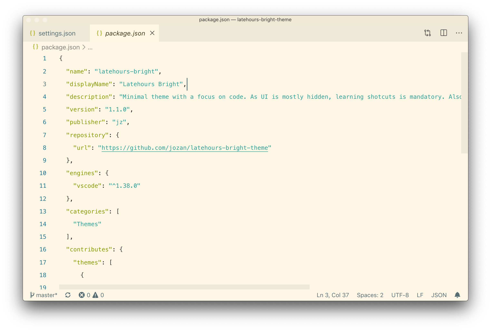

# Latehours Bright

Minimal theme with a focus on code. As UI is mostly hidden, learning shotcuts is mandatory. Also, command palette is your best friend.



### Install

Press `ctrl/command + p` to launch the command palette then run

```
ext install latehours-bright
```

To complete the minimal layout after installing put these into your `settings.json`

```json
  "editor.fontSize": 12,
  "editor.lineHeight": 26,
  "editor.tabSize": 2,
  "editor.renderIndentGuides": false,
  "editor.hideCursorInOverviewRuler": true,
  "editor.minimap.enabled": false,
  // "editor.matchBrackets": false,
  // "editor.occurrencesHighlight": false,
  "editor.renderControlCharacters": false,
  "editor.renderWhitespace": "none",
  "editor.overviewRulerBorder": false,
  "editor.renderLineHighlight": "none",
  "explorer.openEditors.visible": 0,
  "window.zoomLevel": 1,
  "workbench.editor.showIcons": true,
  "workbench.sideBar.location": "right",
  "workbench.activityBar.visible": false,
```

## Credits
This theme is based on Solarized Light.

**Enjoy!**
